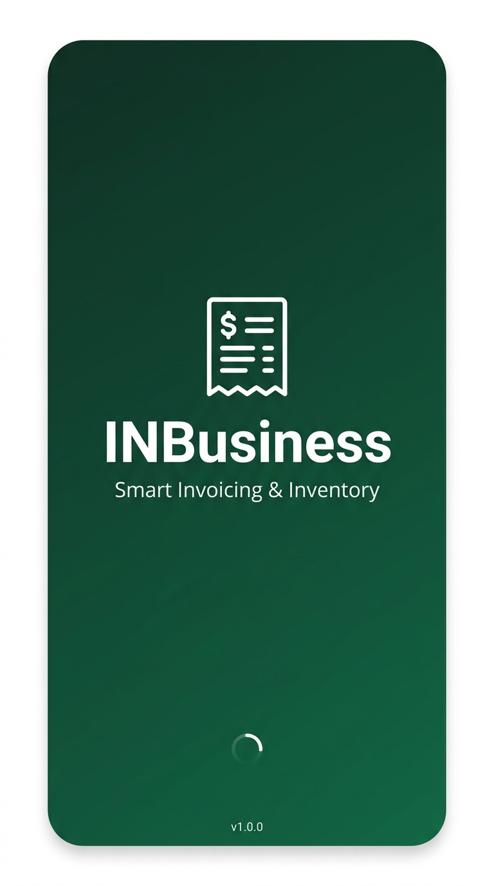
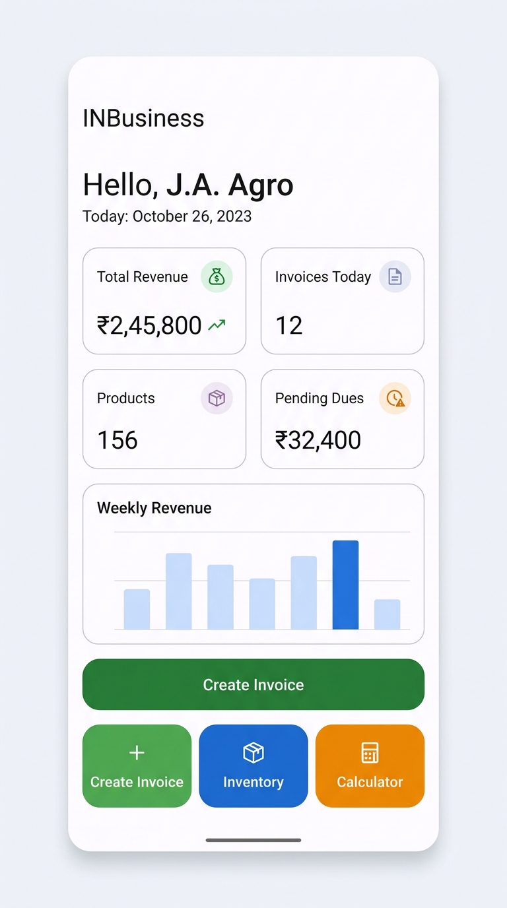
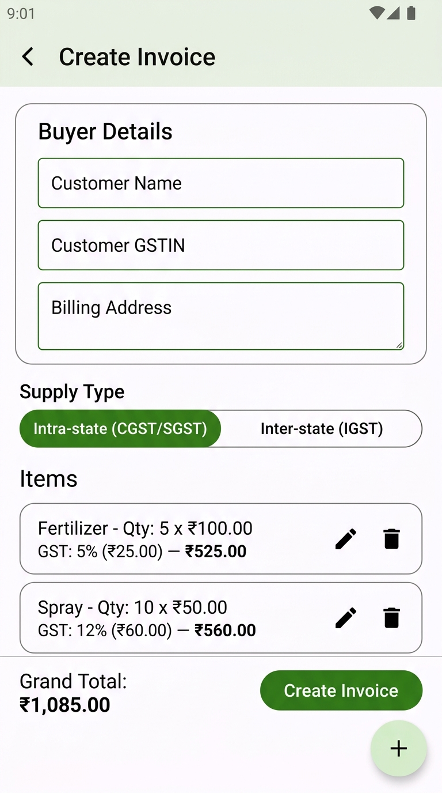
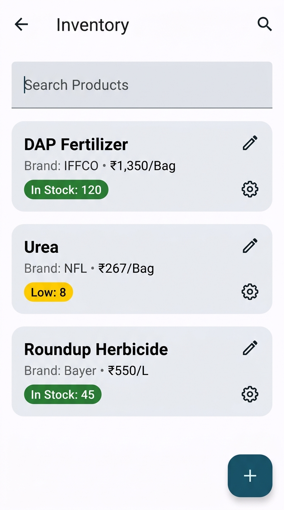

# INBusiness (J.A. Agro Inputs & Trading)

## Features

- **Offline-First Architecture**: Completely functional without an internet connection using Room database and SQLCipher encryption.
- **Smart Invoicing**: Generate GST-compliant invoices (CGST, SGST, IGST) with automatic calculations and supply type detection.
- **Inventory Management**: Track product stock, monitor low-stock items, and manage product catalog.
- **Multi-Tenant Support**: Manage multiple business profiles with isolated data scopes.
- **PDF Generation**: Export invoices to beautifully formatted PDF documents including amount-in-words representation.
- **Idempotent Operations**: Safe, reliable transactions preventing duplicate invoice creation.
- **Built-in Utilities**: Integrated calculator for quick offline calculations.

## App Screenshots

| Splash Screen | Dashboard |
| :---: | :---: |
|  |  |

| Create Invoice | Inventory |
| :---: | :---: |
|  |  |
